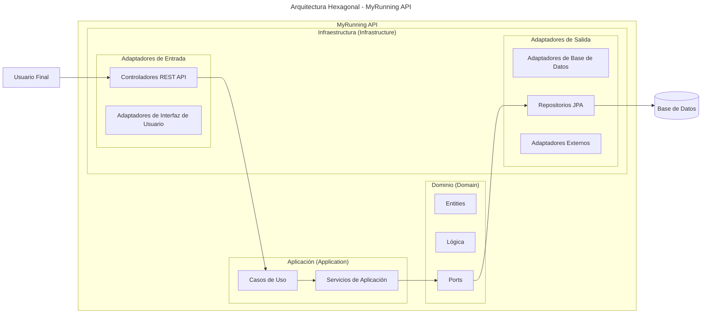

# myRunning

`myRunning` es una aplicación Spring Boot basada en Maven que usa Spring Web MVC, Spring Data JPA y la consola H2 para desarrollo local.

## Descripción

Proyecto inicializado con Spring Boot 4.0.5. Incluye:

- Aplicación principal en `com.jfm.applications.myRunning.Application`
- Soporte de base de datos en memoria H2
- Spring Data JPA para acceso a datos
- Spring Web MVC para construir endpoints web
- DevTools para recarga en caliente en entorno de desarrollo

## Requisitos

- Java 25
- Maven

## Ejecutar la aplicación

Desde la raíz del proyecto:

```shell
mvn spring-boot:run
```

En Windows:

```powershell
.\mvnw.cmd spring-boot:run
```

La aplicación se levantará en `http://localhost:8080`.

## Construir el proyecto

```shell
mvn clean package
```

En Windows:

```powershell
.\mvnw.cmd clean package
```

## Ejecutar pruebas

```shell
mvn test
```

En Windows:

```powershell
.\mvnw.cmd test
```

## Dependencias principales

- `org.springframework.boot:spring-boot-starter-webmvc`
- `org.springframework.boot:spring-boot-starter-data-jpa`
- `org.springframework.boot:spring-boot-h2console`
- `com.h2database:h2`
- `org.projectlombok:lombok` (opcional)
- `org.springframework.boot:spring-boot-devtools` (runtime)

## Notas

- La configuración del proyecto se gestiona en el `pom.xml` y hereda de `spring-boot-starter-parent`.
- Si deseas usar la consola H2, accede a `http://localhost:8080/h2-console` una vez que la aplicación esté en ejecución.

## Estructura principal

- `src/main/java/com/jfm/applications/myRunning/Application.java`
- `src/main/resources/application.properties`
- `src/test/java/com/jfm/applications/myRunning/ApplicationTests.java`

## Arquitectura y Diseño

El proyecto sigue la **Arquitectura Hexagonal** para mantener una separación clara de responsabilidades:



- **Domain**: Contiene las entidades del dominio, la lógica de negocio y los puertos (interfaces)
- **Application**: Casos de uso y servicios de aplicación que orquestan la lógica del dominio
- **Infrastructure**: Adaptadores para entrada (HTTP Controllers) y salida (Bases de datos, servicios externos)

Esta arquitectura permite que el dominio sea independiente de frameworks y detalles técnicos.
